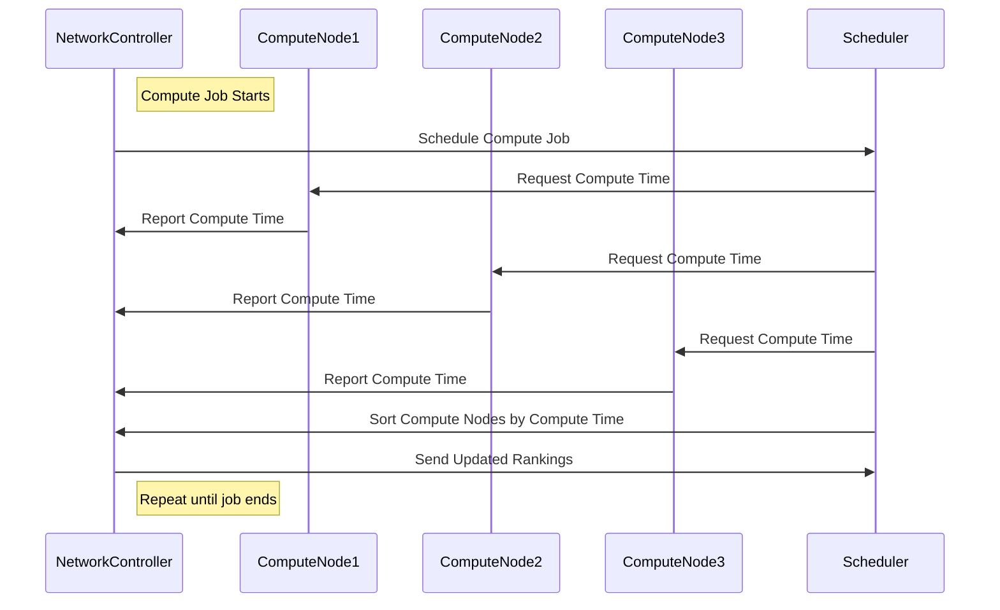

```mermaid
sequenceDiagram
    participant NetworkController
    participant ComputeNode1
    participant ComputeNode2
    participant ComputeNode3
    participant Scheduler
    Note right of NetworkController: Compute Job Starts
    NetworkController ->> Scheduler: Schedule Compute Job
    Scheduler ->> ComputeNode1: Request Compute Time
    ComputeNode1 ->> NetworkController: Report Compute Time
    Scheduler ->> ComputeNode2: Request Compute Time
    ComputeNode2 ->> NetworkController: Report Compute Time
    Scheduler ->> ComputeNode3: Request Compute Time
    ComputeNode3 ->> NetworkController: Report Compute Time
    Scheduler ->> NetworkController: Sort Compute Nodes by Compute Time
    NetworkController ->> Scheduler: Send Updated Rankings
    Note right of NetworkController: Repeat until job ends
```
